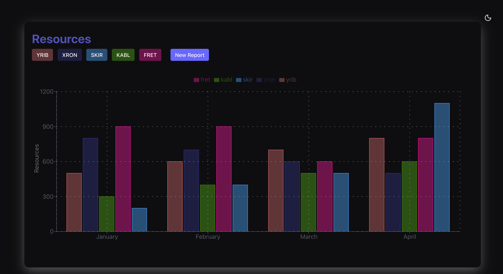
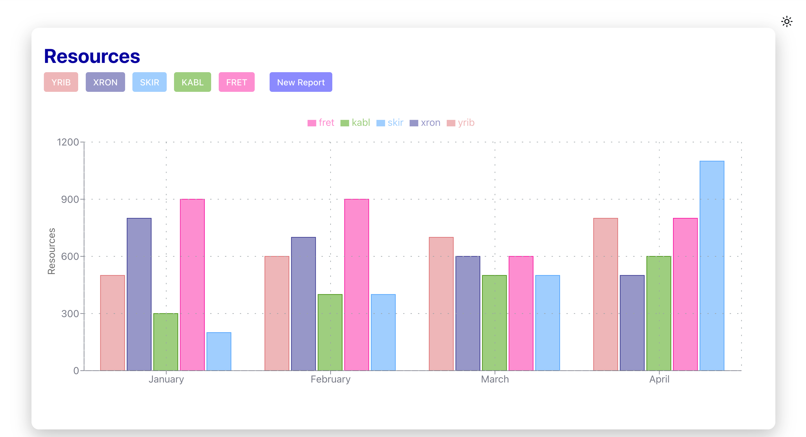

# Resource Dashboard

## Overview

This is a Reflex-based web application that visualizes resource usage data across multiple categories (`YRIB`, `XRON`, `SKIR`, `KABL`, `FRET`) for the first four months of 2025. The application features an interactive bar chart and buttons to display resource usage details for each category, along with a feature to generate new random data for reports.

## Features

- **Interactive Bar Chart**: Displays resource usage data for the categories (`YRIB`, `XRON`, `SKIR`, `KABL`, `FRET`) across four months (January to April 2025).
- **Feedback Buttons**: Clicking on a category button (`YRIB`, `XRON`, `SKIR`, `KABL`, `FRET`) prints resource usage details to the console and shows a toast notification with the data for the last month.
- **New Report Generation**: The "New Report" button generates random resource data for all categories and months, updating the chart dynamically.
- **Dark/Light Mode**: Includes a toggle for switching between light and dark themes.
- **Responsive Design**: The UI is centered and styled with a modern, shadowed card layout, ensuring a clean and professional appearance.

## Visualization




## Technologies Used

- **Reflex**: A Python framework for building web applications.
- **Recharts**: A charting library used for rendering the interactive bar chart.
- **Python**: Backend logic for handling data and events.
- **Random**: Used to generate random data for the "New Report" feature.

## Installation

1. Ensure you have Python installed.
2. Install Reflex and required dependencies:
  
   ```bash
   pip install reflex
   ```

3. Clone or download the project repository.
4. Navigate to the project directory and run:

   ```bash
   reflex init
   reflex run
   ```

5. Open your browser and visit `http://localhost:3000` to view the application.

## Code Structure

- **Backend (`State` class)**:
  - Defines the `data` state as a list of dictionaries containing resource usage for each month.
  - Includes event handlers (`xron_data`, `yrib_data`, `skir_data`, `kabl_data`, `fret_data`) to log and display resource data.
  - Includes a `new_report` event handler to generate random data for all categories.
- **Frontend (`render_chart` function)**:
  - Renders a centered layout with a heading, category buttons, a "New Report" button, and a bar chart.
  - Uses `rx.recharts` for the bar chart, with customized styling, axes, legend, and grid.
  - Applies dynamic styling based on the color mode (light/dark).

## License

This project is licensed under the MIT License.
